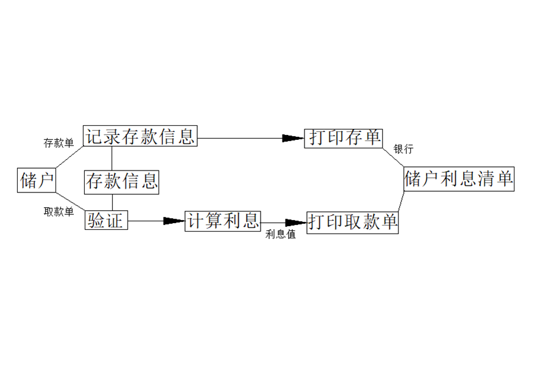
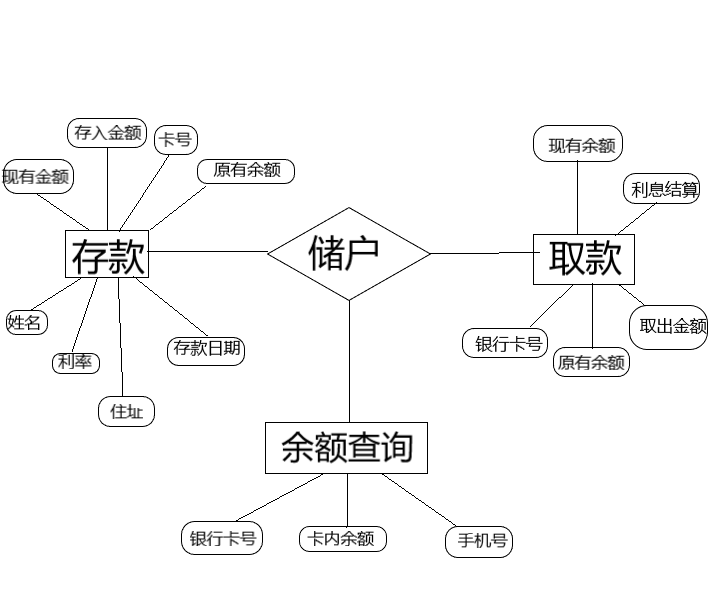

# 一、	任务概述    #
## 1.	问题定义   ##
如果是存款，储户填写存款单，然后交给业务员键入系统，同时系统还要记录存款人姓名、住址（或电话号码）、身份证号码、存款类型、存款日期、利率等信息，完成后由系统打印存款单给储户。
如果是取款，储户填写取款单，然后交给业务员，业务员把取款金额输入系统并要求储户输入密码以确认身份，核对密码正确无误后系统计算利息并印出利息清单给储户。
为了满足储户的需求，该系统需要迅速的对用户的要求做出反馈，要对用户输入的信息作出最快的处理，所以就需要很大的主存容量，以及强大的数据库支持。由于是所面向的用户是广泛的储蓄用户群，所以需要系统强大的安全性能支持。
## 2.	可行性分析   ##
银行的计算机存储系统的使用和管理全部由银行的管理员来承担，客户只需向业务员提交数据即可，所以从技术上分析是可行的，而计算机储蓄系统的成本和开发难度相对较低，所以经济上是可行性是可靠的。操作上客户所需操作几乎没有，而对于工作人员来说简单较为易上手，操作可行性较高。

## 3.	数据流图    ##

# 二、	内部结构   #
## 1.	具体内容   ##
余额查询：
银行卡号、卡内余额、手机号
存款业务：  
银行卡号、原有余额、存入金额、现有金额、现有利率、姓名、住址、存款日期  
取款业务：  
银行卡号、原有余额、取出金额、利息结算、现有余额
## 2.	E-R图   ##
